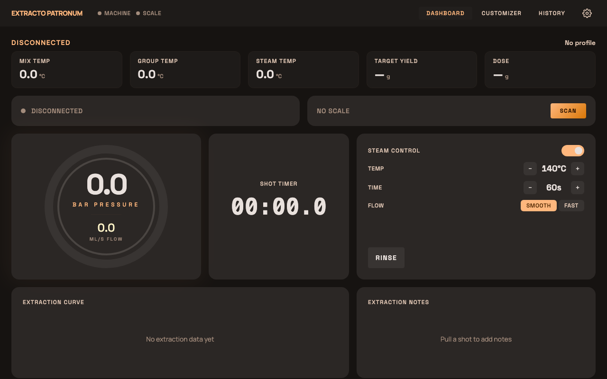
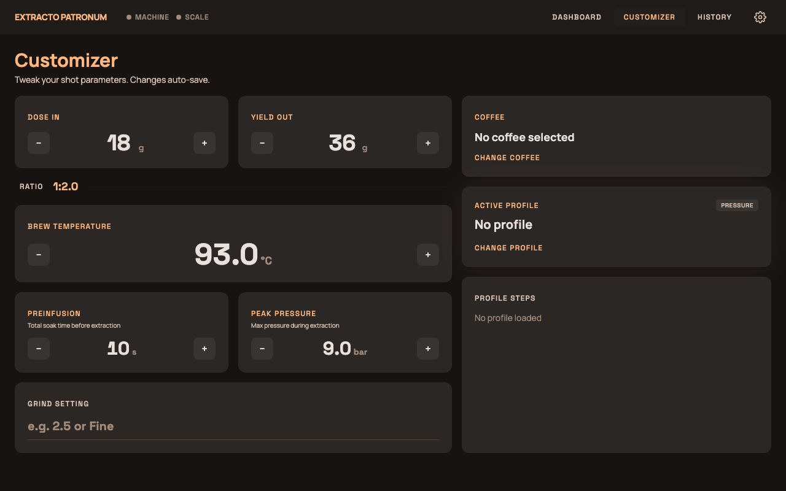

# Extracto Patronum

A dark, warm-toned dashboard UI for the [Decent DE1](https://decentespresso.com/) espresso machine. Think of it as a skin — it talks to the DE1 backend over REST and WebSocket, giving you real-time control and shot tracking in the browser.



## Features

- **Live dashboard** — pressure & flow gauges, shot timer, extraction curve, and steam controls, all updating in real time over WebSocket
- **Extraction lab** — tweak dose, yield, temperature, pressure, and grind parameters on the fly; swap profiles and coffees mid-session
- **Shot journal** — searchable history of every shot with extraction charts, notes, and enjoyment ratings
- **Wake schedules** — set the machine to heat up before you stumble to the kitchen
- **Maintenance tools** — flush, descale, and transport mode at a tap
- **Scale integration** — live weight tracking from a connected Bluetooth scale



## Stack

| Layer | Tech |
|-------|------|
| Framework | Svelte 5 (runes) |
| Routing | svelte-spa-router (hash) |
| Styling | Tailwind CSS v4 |
| Build | Vite 8 |
| Tests | Vitest + jsdom |
| Fonts | Manrope, Space Grotesk |

## Getting started

```bash
npm install
npm run dev
```

Point `VITE_API_HOST` at your DE1 backend (defaults to `localhost`).

```bash
VITE_API_HOST=192.168.1.42 npm run dev
```

## Building

```bash
npm run build   # outputs to dist/
```

The built skin can be deployed as a static site or served directly by the DE1 bridge.

## License

MIT
